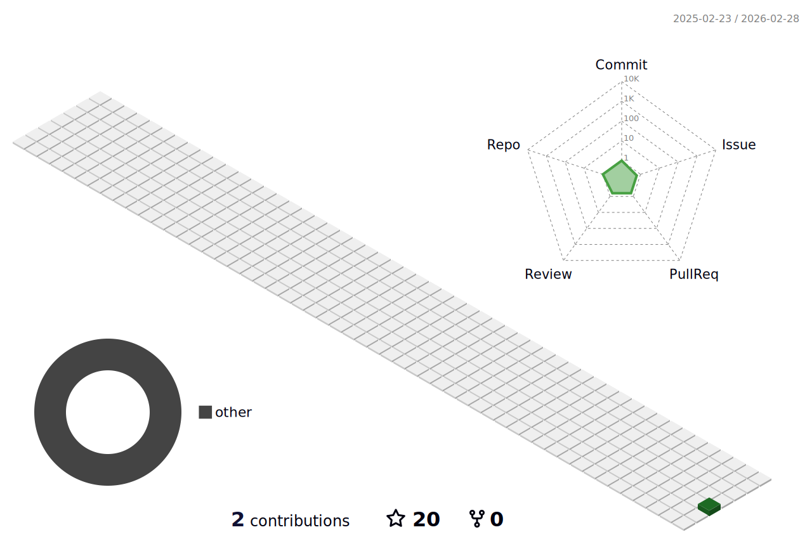

## ¿Quien soy? 👀

Hola, soy Bruno o @Brularre.

Recientemente me gradué de Desarrollador Full Stack y anhelo generar experiencia y participar en proyectos cada vez más grandes.

He aprendido muchas cosas en mi vida y en el código he encontrado un hogar luego de un largo camino. Descubrir Javascript, sus ramas y todas las infinitas posibilidades que provee me parece increíble y estoy ansioso por seguir avanzando hacia construir aplicaciones y software.

Me interesa mucho participar en proyectos y participar en equipos con programador@s más experimentados. ¡Si te puedo colaborar en algo no dudes en escribirme!

## Proyectos 🧰

[Página Ganadora Hackathon Practicum 2022](https://moody-app.netlify.app/)

## Skills 🛠️

 

## Mis contribuciones 🦫

Gracias por detenerte acá :D.

## Contáctame 🤙🏽

[@Brularre](https://github.com/Brularre)
